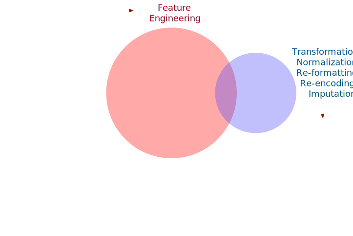

class: title-slide, middle
background-position: 85% 50%
background-size: 30%
background-color: #F9F8F3

# `r rmarkdown::metadata$title`

### `r rmarkdown::metadata$author`


```{r startup, include = FALSE, message = FALSE, warning = FALSE}
library(MLDataR) 
library(naniar)
library(doMC)
registerDoMC(cores = 20)
options(digits = 3, width = 80)

hexes <- function(x) {
  x <- rev(sort(x))
  bad_svg <- c("dplyr", "tidyr")
  x <- ifelse(x %in% bad_svg, paste0(x, ".png"), paste0(x, ".svg"))
  markup <- function(pkg) glue::glue('')
  res <- purrr::map_chr(x, markup)
  paste0(res, collapse = "")
}
```

---
# tidymodels

> The tidymodels framework is a collection of packages for modeling and machine learning using tidyverse principles. 

Our goals:

 * Enable users to fall into the "pit of success".
 * Provide a pleasant and rational interface to many types of models.
 * Provide guardrails, sometimes invisibly, that can prevent methodology errors.

---
layout: false
class: inverse, middle, center


# [`tidymodels.org`](https://www.tidymodels.org/)

# _Tidy Modeling with R_ ([`tmwr.org`](https://www.tmwr.org/))

---
class: middle
background-image: url(images/hex_wall.png)
background-size: 90%


---

# An example - thyroid disorder

A very old data of 3,772 data points for binary classification to predict people who are sick from thyroid disease. 

* Mostly binary predictors
* Class imbalance of about 6%
* Significant amounts of missing data

We will hold back 25% of the data for testing model performance. 


---
# Getting started

.code80[

```{r, warning = FALSE}
library(tidymodels)
library(themis)     # <- for class imbalance sampling
```

]

```{r thyroid, include = FALSE}
data("thyroid_disease")

thyroid_disease <-
  thyroid_disease %>%
  mutate(
    ThryroidClass = factor(ThryroidClass, levels = c("sick", "negative")),
    ref_src = factor(ref_src)
  ) %>%
  filter(patient_age < 100) %>%  # there is one REALLY old patient
  rename(class = ThryroidClass) %>%
  # too many missing values
  select(-T3_reading)
```

---
# Getting started

```{r}
tidymodels_prefer()
theme_set(theme_bw())

# training/test split
set.seed(1)
thy_split <- initial_split(thyroid_disease, strata = class)
thy_train <- training(thy_split)
thy_test  <- testing(thy_split)

# 10-fold cross-validation scheme
thy_folds <- vfold_cv(thy_train, strata = class)

# Columns with missing values
miss_cols <- c("T4_reading", "TSH_reading", "FTI_reading", "thyrox_util_rate_T4U_reading")
```


---
# Missing value patterns

```{r missing}
#| fig.align = "center",
#| dev = "svg",
#| echo = FALSE,
#| dev.args = list(bg = "transparent"),
#| fig.width = 9,
#| fig.height = 5


thm <- theme_bw() + 
  theme(
    panel.background = element_rect(fill = "transparent", colour = NA), 
    plot.background = element_rect(fill = "transparent", colour = NA),
    legend.position = "top",
    legend.background = element_rect(fill = "transparent", colour = NA),
    legend.key = element_rect(fill = "transparent", colour = NA)
  )
theme_set(thm)

gg_miss_upset(thyroid_disease %>% select(-ref_src))
```

---
# A data recipe 

Recipes is a package that can prepare data for modeling. 

* Think of it as a mash-up of `model.matrix()` and `dplyr`.
* It is well integrated with the rest of tidymodels. 
* See TMwR Chapters [8](https://www.tmwr.org/recipes.html) and [16](https://www.tmwr.org/dimensionality.html)

We'll use this to deal with some of the important aspects of these data. 

Recipes are also a _great_ tool for feature engineering (but we won't do much of that here). 

[A list of all known recipe steps](https://www.tidymodels.org/find/recipes/)

---
# What is feature engineering?

First things first: what's a feature? 

I tend to think of a feature as some representation of a predictor that will be used in a model. 

Old-school features: 

 * Interactions
 * Polynomial expansions/splines
 * PCA feature extraction
 
"Feature engineering" sounds pretty cool, but let's take a minute to talk about _preprocessing_ data.  

---
# Two types of preprocessing

```{r venn-titles, echo = FALSE, out.width="75%", fig.align='center'}

```

---
# Two types of preprocessing

```{r venn-info, echo = FALSE, out.width="75%", fig.align='center'}
knitr::include_graphics("images/fe_venn_info.svg")
```


---
# Original column

```{r before-fe, echo = FALSE, out.width="35%", fig.align='center'}

```


---
# Features

```{r after-fe, echo = FALSE, out.width="75%", fig.align='center'}

```


(At least that's what we hope the difference looks like.)

---
# Starting the recipe


```{r}
thyr_rec <- 
  recipe(class ~ ., data = thy_train)
```

Based on the formula, the function assigns columns to roles of "outcome" or "predictor"


---
# Estimating a transformation of the data


```{r}
thyr_rec <- 
  recipe(class ~ ., data = thy_train) %>%
  step_YeoJohnson(TSH_reading) #<<
```

This transformation requires a parameter for estimation and can help with skewed data distributions. 


---
# Imputing missing data


```{r}
thyr_rec <- 
  recipe(class ~ ., data = thy_train) %>%
  step_YeoJohnson(TSH_reading) %>%
  step_impute_knn(all_of(miss_cols), neighbors = 5) #<<
```

Other possible options: `step_impute_bag()`, `step_impute_linear()`, `step_impute_lower()`, `step_impute_mean()`, `step_impute_median()`, `step_impute_mode()`, `step_impute_roll()`

We might want to _optimize_ the number of neighbors to use for imputation. In that case we can tag it using `neighbors = tune()`. 


---
# Create dummy variables


```{r}
thyr_rec <- 
  recipe(class ~ ., data = thy_train) %>%
  step_YeoJohnson(TSH_reading) %>%
  step_impute_knn(all_of(miss_cols), neighbors = 5) %>% 
  step_dummy(all_nominal_predictors()) #<<
```

Recipes do not automatically create indicator variables from categorical (a.k.a. nominal) predictors. 

There are a _lot_ of tools for this in recipers. See [TMwR](https://www.tmwr.org/categorical.html). 


---
# Dealing with the class imbalance


```{r}
thyr_rec <- 
  recipe(class ~ ., data = thy_train) %>%
  step_YeoJohnson(TSH_reading) %>%
  step_impute_knn(all_of(miss_cols), neighbors = 5) %>% 
  step_dummy(all_nominal_predictors()) %>% 
  step_smote(class, neighbors = 10)#<<
```

[SMOTE](https://scholar.google.com/scholar?hl=en&as_sdt=0%2C7&q=SMOTE) is a method to synthesize new samples from the classes to enrich the minority class. 

It's not a great solution and is fairly controversial (in statistics, at least). 

Again, we can optimize the number of SMOTE neighbors too. 

The themis package has other tools for imbalances and some models can be used in cost-sensitive learning. 

---
# Eliminate zero-variance predictors


```{r}
thyr_rec <- 
  recipe(class ~ ., data = thy_train) %>%
  step_YeoJohnson(TSH_reading) %>%
  step_impute_knn(all_of(miss_cols), neighbors = 5) %>% 
  step_dummy(all_nominal_predictors()) %>% 
  step_smote(class, neighbors = 10) %>%
  step_zv(all_predictors()) #<<
```

This removes columns that have a single unique value (i.e., zero variance). 

---
# A basic logistic regression

```{r, cache = TRUE}
ctrl <- control_resamples(save_pred = TRUE)
lr_res <- 
  logistic_reg() %>% 
  fit_resamples(thyr_rec, resamples = thy_folds, control = ctrl)

show_best(lr_res, metric = "roc_auc")
```

_Both_ the recipe and model are re-estimated 10 times since we are using 10-fold CV. 

If we had used `tune()` for any of the model or recipe parameters, there are a set of tuning functions: `tune_grid()`, `tune_bayes()`, `tune_race_anova()`, and others. 

---
# Other notes

* These models fits are independent of one another. [Parallel processing](https://www.tmwr.org/resampling.html#parallel) can be used to significantly speed up the training process. 
* The individual models can [be saved](https://www.tmwr.org/resampling.html#extract) so you can look at variation in the model parameters or recipes steps. 
* If you are interested in a [validation set](https://www.tmwr.org/resampling.html#validation), tidymodels considers that a single resample of the data. Everything else in this chapter works the same. 
* Formulas can also be used to specify the model terms.


---
# Resampled ROC curve

.pull-left[
```{r roc-code}
#| eval = FALSE
lr_res %>% 
  collect_predictions() %>% 
  roc_curve(class, .pred_sick) %>% 
  autoplot()
```
]
.pull-right[
```{r roc-plot}
#| fig.align = "center",
#| fig.width = 5,
#| fig.height = 5,
#| dev = "svg",
#| dev.args = list(bg = "transparent"),
#| echo = FALSE

lr_res %>% 
  collect_predictions() %>% 
  roc_curve(class, .pred_sick) %>% 
  ggplot(aes(x = 1 - specificity, y = sensitivity)) + 
  geom_abline(lty = 3) + 
  geom_step() +
  coord_obs_pred()
```
]


---
# tidymodels

There's a lot more to talk about with tidymodels, but this example is emblematic of the power and security of the framework. 

We'll finish up with [David Robinson](http://varianceexplained.org/r/sliced-ml/):

> Some of the resistance I’ve seen to tidymodels comes from a place of “This makes it too easy- you’re not thinking carefully about what the code is doing!” But I think this is getting it backwards. By removing the burden of writing procedural logic, I get to focus on scientific and statistical questions about my data and model.


---

# Thanks

Thanks for the invitation to speak today!

The tidymodels team: Davis Vaughan, Julia Silge, Hanna Frick, and Emil Hvitfeldt.

Special thanks for the other folks who contributed so much to tidymodels: Edgar Ruiz, Alison Hill, Desirée De Leon, Simon Couch, Alex Hayes, Mine Cetinkaya-Rundel, and the tidyverse team.

These slides were made with the [`xaringan`](https://bookdown.org/yihui/rmarkdown/xaringan.html) package and styled by Alison Hill. 
